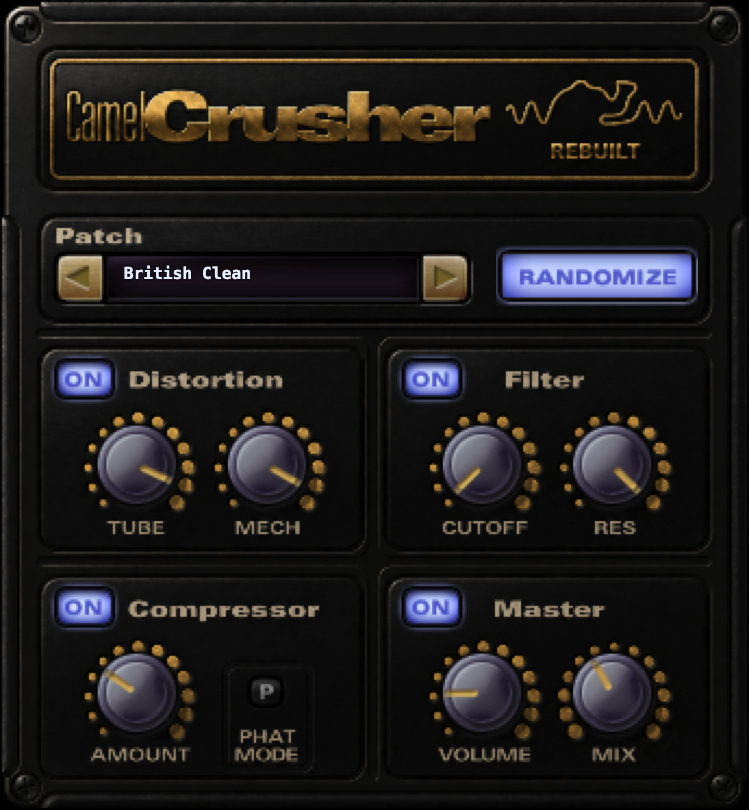

# CamelCrusher Rebuilt



`CamelCrusher Rebuilt` is a native Apple Silicon remake of CamelCrusher for modern macOS.

It is built around a simple goal: old sessions should open again, and modern Mac users should have a native way to keep using CamelCrusher without depending on the original abandoned setup.

It currently targets:

- `AU`
- `VST2`
- `VST3`

`VST2` is the compatibility path for reopening previous sessions that used CamelCrusher. The current host-facing plug-in name is still `CamelCrusher`.

## Download

Download the latest macOS installer from [GitHub Releases](https://github.com/lostlessvisuals/camelcrusher-rebuilt/releases).

## Why

CamelCrusher was a staple plug-in for a lot of Mac users, but on modern macOS, and especially on Apple Silicon, the original workflow became increasingly fragile or unavailable. `CamelCrusher Rebuilt` exists to bring that workflow back in a native form.

## Current Status

The project is working locally on Apple Silicon macOS across all three formats, with verified `VST2` session recall and matching custom UI across the current wrappers.

## Build

```bash
cmake -S . -B build
cmake --build build
ctest --test-dir build --output-on-failure
```

## More

- Engineering details: [docs/ENGINEERING_GUIDE.md](docs/ENGINEERING_GUIDE.md)
- Release/install notes: [docs/RELEASE_GUIDE.md](docs/RELEASE_GUIDE.md)
- Current project continuity: [docs/CURRENT_HANDOFF.md](docs/CURRENT_HANDOFF.md)
